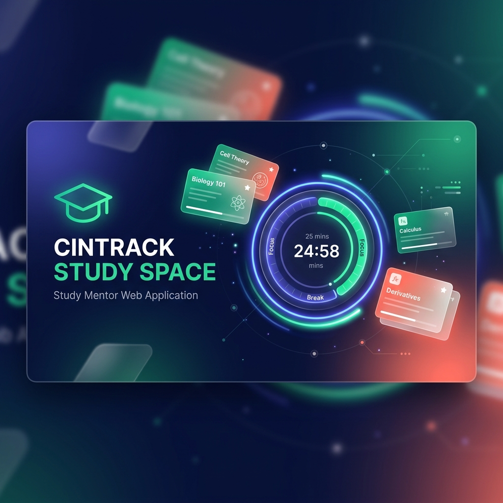

# CinTrack Study Space 🚀



CinTrack Study Space (also known as **Study Mentor**) is a premium, feature-rich Single Page Application (SPA) designed to help students and learners optimize their study sessions. It integrates task management, an interactive Pomodoro timer, flashcard active recall decks, multiple-choice quizzes, and a scheduled pop-quiz reminder system into one cohesive, beautifully designed workspace.

The application is built using a modern, responsive interface utilizing custom styling, clean typography (Inter and Outfit Google Fonts), glassmorphic elements, smooth micro-animations, and full support for both Dark and Light themes.

---

## 📸 Screenshots & Interface
The app features a responsive dual-column dashboard, interactive modal overlays, custom circular progress rings, 3D card flip transitions, and an elegant sidebar navigation menu.

---

## 🛠️ Key Features

1. **Dashboard & Analytics**:
   - A welcoming workspace banner summarizing user goals.
   - Synchronized stats tracker: Tasks Completed, Total Study Duration (hours/minutes), Cards Reviewed, and Quiz Accuracy.
   - Today's priority tasks checklist with instant toggle completion.
   - Quick-access Pomodoro widget showing the active timer status.

2. **Task Management (Study Tasks)**:
   - Create, edit, and delete study-oriented tasks.
   - Custom priority levels (High, Medium, Low) and Category Tags (e.g., Coding, Math, History).
   - Datetime scheduling with visual "Overdue" status indicators.
   - Robust client-side filtering (All, Active, Completed) and sorting (Due Date, Priority, Alphabetical).

3. **Pomodoro Timer**:
   - Customizable time lengths for Work Sessions, Short Breaks, and Long Breaks.
   - Interactive SVG progress ring indicating time remaining.
   - Active study time tracking down to the second, which dynamically updates dashboard stats.
   - Native notification alerts and synthesized auditory cues (beep sequences generated using the browser's Web Audio API) on session completion.
   - Title countdown indicator showing remaining session time in the browser tab.

4. **Flashcards & Active Recall**:
   - Dynamic flashcard decks categorized by subject with color-coded custom accents.
   - 3D card-flip animation utilizing CSS transform properties.
   - Active recall grading system (Easy, Medium, Hard).
   - Queue prioritization: Cards marked as "Hard" are automatically appended back to the study queue for repeated testing.

5. **Quiz Maker & Practice Bank**:
   - Custom multiple-choice question builder with optional answer options.
   - "Quick Practice" mode that shuffles all available bank questions for structured self-testing.
   - Dynamic correct/incorrect feedback overlays with accurate performance analytics.
   - Scheduled Pop-Quiz reminders triggered in the background based on configurable minute intervals, prompting users to answer questions periodically.

6. **System Preferences & Tools**:
   - Real-time digital clock header.
   - Smooth transitions between Dark Mode (default) and Light Mode.
   - Resilient local storage persistence.

---

## 🏗️ System Architecture

The application is structured as a modular client-side Single Page Application (SPA). All UI layouts are defined within `index.html`, styled using custom vanilla CSS, and controlled by decoupled vanilla JavaScript modules that share a centralized, persisted state object.

### Architectural Diagram

```mermaid
graph TD
    subgraph SPA [Single Page Application]
        index["index.html (UI Layout & Modal Overlays)"]
        style["style.css (Styling & Glassmorphism & Animations)"]
    end

    subgraph State Management
        state["window.StudySpaceState (Global State Object)"]
        ls["localStorage (cintrack_studyspace_state_v1)"]
    end

    subgraph Modules
        app["app.js (Core Orchestrator & Router)"]
        todo["todo.js (Task Module)"]
        pomo["pomodoro.js (Pomodoro Timer Module)"]
        flash["flashcards.js (Flashcards & Active Recall Module)"]
        quiz["quiz.js (Quiz Builder & Reminder Module)"]
    end

    subgraph Browser & System APIs
        audio["Web Audio API (Synthesized Buzzers)"]
        notif["Web Notification API (Desktop Alerts)"]
        loc["window.location & DOM Events"]
    end

    %% Interactions
    app -->|Loads/Saves| state
    state <-->|Syncs With| ls
    
    app -->|Coordinates Tabs/Theme/Time| index
    
    todo -->|Reads/Writes Tasks| state
    todo -->|Renders UI| index
    
    pomo -->|Reads/Writes Timer Config & Stats| state
    pomo -->|Updates SVG Ring & Timer UI| index
    pomo -->|Triggers sound| audio
    pomo -->|Sends alert| notif
    
    flash -->|Reads/Writes Decks & Review Cards| state
    flash -->|Toggles 3D flip & Renders Decks| index
    
    quiz -->|Reads/Writes Quizzes & Reminder Settings| state
    quiz -->|Renders Quizzes & Reminders| index
    quiz -->|Triggers pop quizzes| notif
    quiz -->|Runs background intervals| loc

    classDef core fill:#818cf8,stroke:#4f46e5,stroke-width:2px,color:#fff;
    classDef state fill:#f472b6,stroke:#db2777,stroke-width:2px,color:#fff;
    classDef module fill:#38bdf8,stroke:#0284c7,stroke-width:2px,color:#fff;
    classDef api fill:#fb7185,stroke:#e11d48,stroke-width:2px,color:#fff;

    class app core;
    class state,ls state;
    class todo,pomo,flash,quiz module;
    class audio,notif,loc api;
```

### Module Breakdown

1. **Central State & Lifecycle Manager (`app.js`)**:
   - Declares the single-source-of-truth state container `window.StudySpaceState` containing tasks, flashcard decks, quizzes, user statistics, timer settings, notification preferences, and active themes.
   - Manages persistence to `localStorage` under `cintrack_studyspace_state_v1` using deep merging to maintain backward-compatibility.
   - Seeds mock study data upon initial application launch if no storage key exists.
   - Handles the Single Page Application navigation routing by dispatching a custom `tabChanged` event.
   - Governs the dark/light theme toggle and runs the system clock header interval.

2. **Task Coordinator (`todo.js`)**:
   - Manages tasks inside `window.StudySpaceState.tasks`.
   - Binds UI inputs for adding/editing tasks through modal forms.
   - Supports filtering (Active, Completed, All) and sorts tasks using weights (High=3, Medium=2, Low=1) or due dates.
   - Hooks into custom global events (`tasksStateUpdated`, `appStateLoaded`) to synchronize views when items are toggled from the dashboard.

3. **Pomodoro Engine (`pomodoro.js`)**:
   - Runs a `setInterval`-driven countdown tracker.
   - Accumulates cumulative work study durations in the background and saves progress incrementally.
   - Calculates the SVG stroke-dashoffset of `timerRing` to update the graphical timer ring dynamically.
   - Plays completion buzzers by creating oscillator nodes with smooth gain ramps using the browser's native **Web Audio API** (avoiding external audio dependencies).
   - Updates the browser document title dynamically.

4. **Flashcards Controller (`flashcards.js`)**:
   - Handles deck list arrays and colored rendering swatches.
   - Controls the flashcard 3D flip card toggle via standard CSS transform classes.
   - Implements study session progress, shuffling decks, and handles active recall intervals.

5. **Quiz & Reminder System (`quiz.js`)**:
   - Manages multiple-choice question builders and validation logic.
   - Handles structured "Practice Sessions" by copying and shuffling arrays.
   - Features a Pop-Quiz scheduler running background loop intervals. When active, it triggers system desktop notices via the **Web Notification API** and slides open an overlays modal.

---

## 📂 Project Directory Structure

```text
cintrack/
├── index.html        # Main SPA interface, layouts, SVG icons, and modal templates
├── style.css         # Custom stylesheet (variables, fonts, dark/light theme tokens, animations)
├── app.js            # Central state configuration, storage, router, and initialization
├── todo.js           # Task management logic, rendering, filtering, and sorting
├── pomodoro.js       # Pomodoro timer logic, audio synth, and SVG ring controller
├── flashcards.js     # Subject deck management, study view, and 3D flip controls
└── quiz.js           # Quiz constructor, practice engine, and pop-quiz notifications
```

---

## 🚀 Getting Started

### Prerequisites
To run CinTrack Study Space locally, you only need a modern web browser that supports modern JavaScript ES6, the Web Audio API, and the Web Notification API (e.g., Chrome, Edge, Safari, Firefox).

### Running the App
1. **Direct Browser Launch**:
   Simply double-click `index.html` or open it directly in your browser.
   
2. **Local Development Server**:
   For the best experience (including desktop browser notifications, which can require a server environment in certain browsers), run a lightweight web server in the directory:
   ```bash
   # Using Python 3
   python -m http.server 8000
   
   # Using Node.js (npx)
   npx serve .
   ```
   Then open `http://localhost:8000` or `http://localhost:3000` in your web browser.
